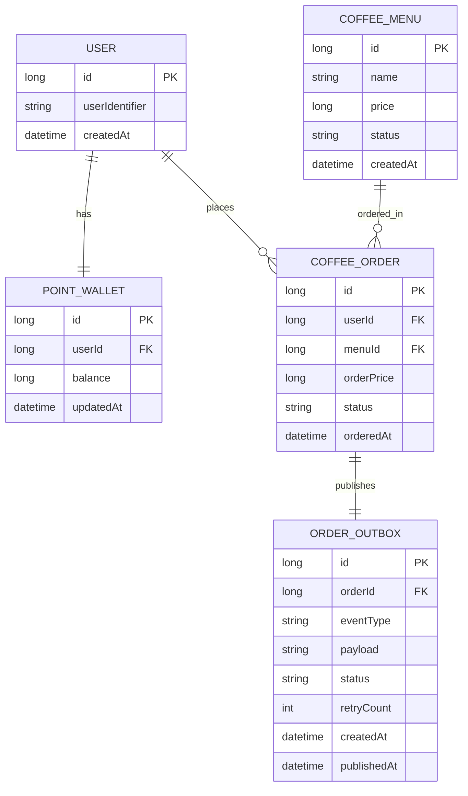
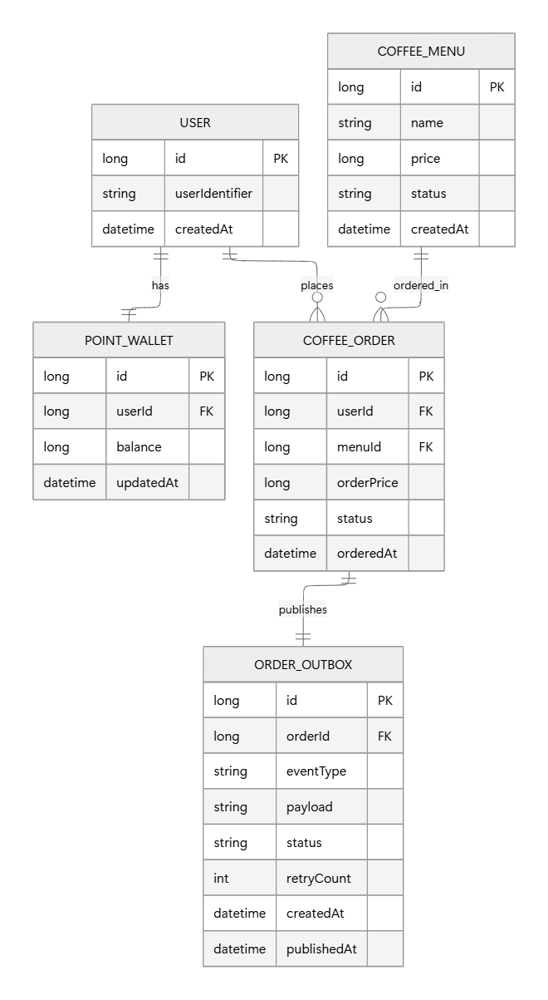
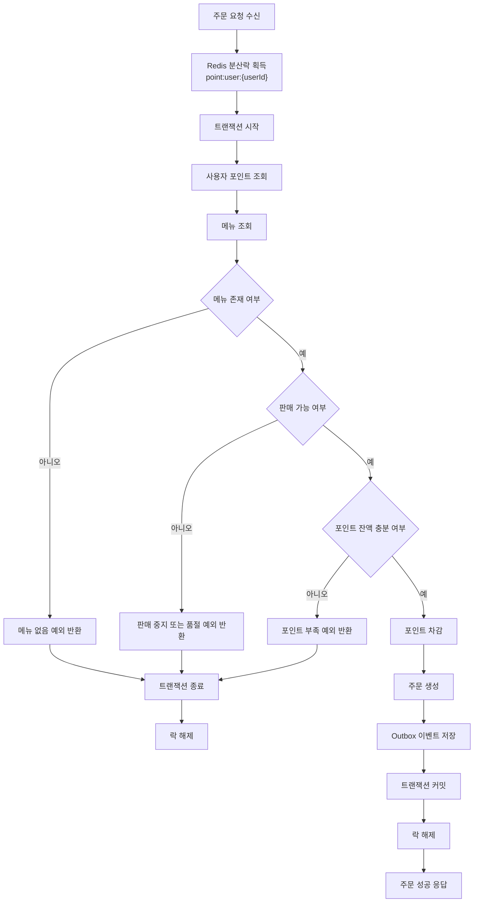
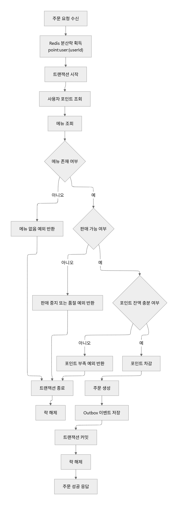
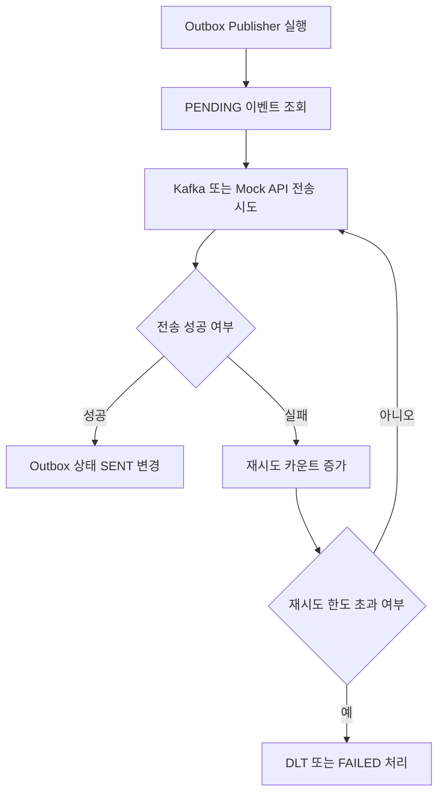
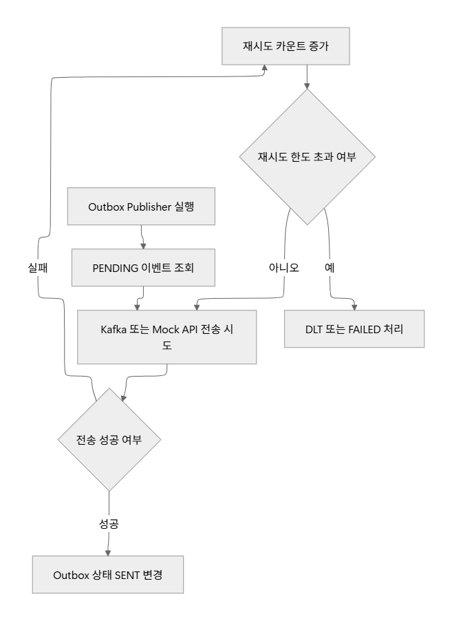
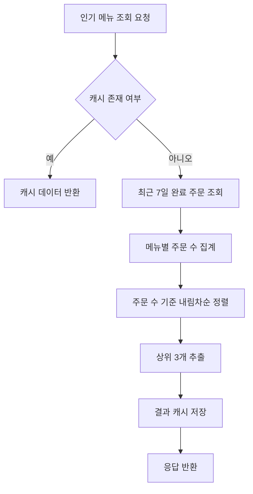
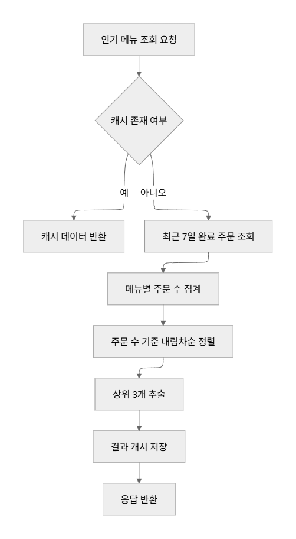

# Coffee Order System Architecture

## ERD

```mermaid
erDiagram
    USER ||--|| POINT_WALLET : has
    USER ||--o{ COFFEE_ORDER : places
    COFFEE_MENU ||--o{ COFFEE_ORDER : ordered_in
    COFFEE_ORDER ||--|| ORDER_OUTBOX : publishes

    USER {
        long id PK
        string userIdentifier
        datetime createdAt
    }

    POINT_WALLET {
        long id PK
        long userId FK
        long balance
        datetime updatedAt
    }

    COFFEE_MENU {
        long id PK
        string name
        long price
        string status
        datetime createdAt
    }

    COFFEE_ORDER {
        long id PK
        long userId FK
        long menuId FK
        long orderPrice
        string status
        datetime orderedAt
    }

    ORDER_OUTBOX {
        long id PK
        long orderId FK
        string eventType
        string payload
        string status
        int retryCount
        datetime createdAt
        datetime publishedAt
    }
```

## 주문/결제 처리 플로우

```mermaid
flowchart TD
    A["주문 요청 수신"] --> B["Redis 분산락 획득<br/>point:user:{userId}"]
    B --> C["트랜잭션 시작"]
    C --> D["사용자 포인트 조회"]
    D --> E["메뉴 조회"]
    E --> F{"메뉴 존재 여부"}

    F -- "아니오" --> G["메뉴 없음 예외 반환"]
    G --> H["트랜잭션 종료"]
    H --> I["락 해제"]

    F -- "예" --> J{"판매 가능 여부"}
    J -- "아니오" --> K["판매 중지 또는 품절 예외 반환"]
    K --> H

    J -- "예" --> L{"포인트 잔액 충분 여부"}
    L -- "아니오" --> M["포인트 부족 예외 반환"]
    M --> H

    L -- "예" --> N["포인트 차감"]
    N --> O["주문 생성"]
    O --> P["Outbox 이벤트 저장"]
    P --> Q["트랜잭션 커밋"]
    Q --> R["락 해제"]
    R --> S["주문 성공 응답"]
```

## Outbox 이벤트 전송 플로우

```mermaid
flowchart TD
    A["Outbox Publisher 실행"] --> B["PENDING 이벤트 조회"]
    B --> C["Kafka 또는 Mock API 전송 시도"]
    C --> D{"전송 성공 여부"}

    D -- "성공" --> E["Outbox 상태 SENT 변경"]
    D -- "실패" --> F["재시도 카운트 증가"]
    F --> G{"재시도 한도 초과 여부"}

    G -- "아니오" --> C
    G -- "예" --> H["DLT 또는 FAILED 처리"]
```

## 인기 메뉴 조회 플로우

```mermaid
flowchart TD
    A["인기 메뉴 조회 요청"] --> B{"캐시 존재 여부"}
    B -- "예" --> C["캐시 데이터 반환"]
    B -- "아니오" --> D["최근 7일 완료 주문 조회"]
    D --> E["메뉴별 주문 수 집계"]
    E --> F["주문 수 기준 내림차순 정렬"]
    F --> G["상위 3개 추출"]
    G --> H["결과 캐시 저장"]
    H --> I["응답 반환"]
```
