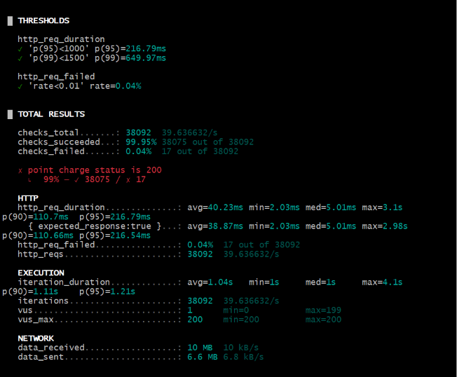
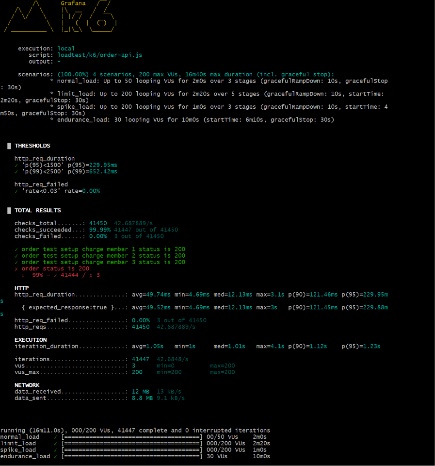
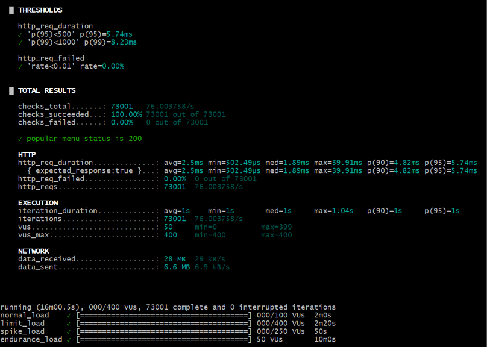

# Load Test Guide

## 1. 목적

현재 구현한 아래 API의 기본 부하 대응력을 검증한다.

- 포인트 충전 API
- 주문/결제 API
- 인기 메뉴 조회 API

초기 검증 목적은 초고트래픽 대응이 아니라, 과제 범위에서 현실적인 혼잡 상황에서 정합성과 응답 성능이 무너지지 않는지 확인하는 것이다.

## 2. 부하 테스트 도구

`k6`를 사용한다.

이유:

- 단일 스크립트로 반복 실행이 쉽다.
- 로컬 환경에서도 빠르게 시나리오 검증이 가능하다.
- 응답 시간, 에러율, 처리량 확인이 편하다.

## 3. 시나리오 파일

- `loadtest/k6/point-charge.js`
- `loadtest/k6/order-api.js`
- `loadtest/k6/popular-menu.js`

공통 요청 함수와 환경 변수는 `loadtest/k6/common.js`에서 관리한다.

## 4. 실행 전 준비

1. Redis, MySQL, 애플리케이션 서버를 실행한다.
2. 테스트 대상 회원과 메뉴 데이터가 준비되어 있는지 확인한다.
3. 주문 API 부하 테스트 전에는 대상 회원 포인트를 충분히 충전해둔다.

기본 환경 변수:

- `BASE_URL`: 기본값 `http://localhost:8080`
- `MEMBER_ID`: 기본값 `1`
- `MENU_ID`: 기본값 `1`
- `CHARGE_AMOUNT`: 기본값 `5000`

## 5. 실행 방법

### 5.1 포인트 충전 API

```bash
k6 run loadtest/k6/point-charge.js
```

### 5.2 주문/결제 API

```bash
k6 run loadtest/k6/order-api.js
```

### 5.3 인기 메뉴 조회 API

```bash
k6 run loadtest/k6/popular-menu.js
```

환경 변수를 함께 줄 수도 있다.

```bash
k6 run -e BASE_URL=http://localhost:8080 -e MEMBER_ID=1 -e MENU_ID=1 loadtest/k6/order-api.js
```

## 6. 시나리오 기준

현재 `k6` 스크립트에는 아래 4가지 부하 유형을 모두 넣어두었다.

- 일반 부하 테스트
- 한계 테스트
- 급상승 테스트
- 내구성 테스트

### 6.1 일반 부하

- 포인트 충전 API: 최대 50 VU
- 주문/결제 API: 최대 50 VU
- 인기 메뉴 조회 API: 최대 100 VU

이유:

- 과제 규모의 커피 주문 시스템에서 점심 시간, 이벤트 직후, 수업/과제 마감 직전처럼 사용이 한 번에 몰리는 구간을 가정한 수치다.
- 소규모 서비스나 초기 운영 단계에서는 절대 사용자 수보다 특정 짧은 시간에 동시에 눌리는 요청이 더 현실적인 병목 원인이 된다.
- 50~100 수준이면 한 명씩 천천히 쓰는 평균 상황이 아니라, 실제로 체감될 정도의 혼잡을 만들면서도 로컬 환경 검증이 가능한 범위다.

### 6.2 급상승 부하

- 주문/결제 API는 10 VU에서 200 VU까지 빠르게 증가하도록 구성했다.

이유:

- 한정 시간 할인, 공지 직후, 특정 시간대 집중 주문처럼 짧은 순간에 요청이 몰리는 상황을 보기 위함이다.
- 분산락, 비관적 락, 커넥션 풀, Outbox 저장 구간의 병목이 빠르게 드러난다.

## 7. 주요 관찰 지표

- 평균 응답 시간
- `p95`, `p99`
- 에러율
- 처리량
- 락 경합 여부
- DB 커넥션 점유 상태
- Redis 응답 지연 여부

## 8. 해석 포인트

### 8.1 포인트 충전 API

- 에러율이 낮아야 한다.
- 낙관적 락 충돌이 발생하더라도 예외 비율이 과도하지 않아야 한다.

### 8.2 주문/결제 API

- 포인트 부족, 락 획득 실패, 중복 요청 처리 결과를 함께 본다.
- 성공 건수와 실제 주문 생성 건수, 포인트 차감 이력이 맞는지 함께 확인한다.

### 8.3 인기 메뉴 조회 API

- 캐시 적중 이후 응답 시간이 안정적으로 낮아지는지 확인한다.
- Redis ZSET 기반 집계가 반복 조회에서 병목이 없는지 본다.

## 9. 운영 시 주의사항

- 주문 API 부하 테스트는 실제 포인트를 계속 차감하므로 테스트 전용 회원으로 실행하는 것이 좋다.
- 주문 API는 매 요청마다 새로운 `idempotencyKey`를 생성하도록 구성했다.
- 로컬 환경에서는 애플리케이션 문제보다 PC 자원 한계가 먼저 드러날 수 있으므로 결과 해석 시 이를 감안한다.

## 10. 테스트 실행 결과

### 10.1 포인트 충전 API

실행 환경:

- 스크립트: `loadtest/k6/point-charge.js`
- 기준 회원: `memberId = 1`
- 충전 금액: `1000`
- 시나리오 구성:
  - 일반 부하
  - 한계 테스트
  - 급상승 테스트
  - 내구성 테스트

실행 결과:

- 총 요청 수: `38,092`
- 초당 요청 수: `39.63 req/s`
- 평균 응답 시간: `40.23ms`
- 중앙값 응답 시간: `5.01ms`
- `p95`: `216.79ms`
- `p99`: `649.97ms`
- 최대 응답 시간: `3.1s`
- 실패율: `0.04%`
- 성공 체크: `38,075 / 38,092`
- 실패 체크: `17 / 38,092`
- 최대 VU: `200`

결과 이미지:



Threshold 결과:

- `http_req_duration p(95) < 1000ms`: 통과
- `http_req_duration p(99) < 1500ms`: 통과
- `http_req_failed rate < 0.01`: 통과

해석:

- 포인트 충전 API는 최대 `200 VU` 구간까지 전반적으로 안정적으로 동작했다.
- `p95`, `p99` 모두 기준 이내로 들어와 일반 부하와 급상승 구간에서 응답 성능이 양호했다.
- 실패율 `0.04%`는 매우 낮은 수준이라 전체 결과는 좋은 편으로 볼 수 있다.
- 다만 실패한 `17건`이 존재하므로, 실무 기준에서는 서버 로그와 DB 상태를 함께 확인해 원인을 추적하는 것이 좋다.
- 평균 응답 시간보다 중앙값이 매우 낮게 나온 것으로 보아, 대부분 요청은 빠르게 처리됐고 일부 구간에서만 지연이 발생한 것으로 해석할 수 있다.

판정:

- 과제 제출 기준으로는 충분히 양호한 결과다.
- 특히 응답 시간 기준과 실패율 기준을 모두 만족했기 때문에 1차 부하 테스트는 통과로 봐도 무방하다.
- 이후 고도화 단계에서는 실패 `17건`의 원인이 낙관적 락 충돌인지, 일시적 타임아웃인지, 검증 예외인지 분리해서 확인하면 더 좋다.

### 10.2 주문/결제 API

#### 1차 실행 결과

초기 주문 부하 테스트는 같은 회원 1명에게 주문을 집중시키는 방식으로 실행했다.
이 경우 포인트 부족과 특정 회원 집중 부하가 함께 섞이면서 실패율이 크게 높아졌다.

초기 결과 요약:

- `p95 = 1.93s`
- `p99 = 3.09s`
- `http_req_failed = 64.62%`

초기 해석:

- 응답 시간과 실패율 모두 기준을 만족하지 못했다.
- 다만 이 결과를 바로 주문 API 성능 문제로 단정할 수는 없었다.
- 같은 회원에게만 주문을 몰아넣는 시나리오 때문에 포인트 부족과 회원 집중 경합이 함께 발생했을 가능성이 높았다.

#### 수정한 점

주문 부하 테스트 스크립트를 아래와 같이 보완했다.

- 테스트 시작 전 `setup()`에서 대상 회원 포인트를 충분히 자동 충전하도록 수정
- `MEMBER_IDS` 환경 변수로 여러 회원을 받아 주문을 분산하도록 수정
- 사전 충전에 성공한 회원만 실제 주문 대상에 포함하도록 수정

#### 2차 실행 결과

재실행 명령어:

```bash
k6 run -e BASE_URL=http://localhost:8080 -e MEMBER_IDS=1,2,3 -e MENU_ID=1 -e ORDER_TEST_INITIAL_CHARGE=300000000 loadtest/k6/order-api.js
```

재실행 결과:

- 총 요청 수: `41,450`
- 평균 응답 시간: `49.74ms`
- `p95`: `229.95ms`
- `p99`: `652.42ms`
- 실패율: `0.00%`
- 실패 체크: `3 / 41,450`
- 최대 VU: `200`

결과 이미지:



Threshold 결과:

- `http_req_duration p(95) < 1500ms`: 통과
- `http_req_duration p(99) < 2500ms`: 통과
- `http_req_failed rate < 0.03`: 통과

해석:

- 테스트 시나리오를 실제 주문 구조에 맞게 보정한 뒤에는 주문 API도 안정적으로 동작했다.
- `p95`, `p99` 모두 기준보다 훨씬 낮게 나왔고, 실패율도 사실상 0% 수준으로 확인됐다.
- 실패 `3건`은 전체 요청 수 대비 매우 적은 수치이므로, 서버 로그로 개별 원인만 확인하면 된다.

재검증 전후 비교:

- 실패율은 `64.62%`에서 `0.00%` 수준으로 낮아졌다.
- `p95`는 `1.93s`에서 `229.95ms`로 안정화됐다.
- 이번 변화는 코드 최적화만의 결과라기보다, 주문 도메인 특성을 반영한 테스트 시나리오 보정 효과를 함께 보여준다.

판정:

- 현재 주문/결제 API 부하 테스트는 과제 제출 기준으로 통과로 봐도 무방하다.
- 이번 결과는 주문 API 성능뿐 아니라, 부하 테스트에서 테스트 데이터와 시나리오 설계가 얼마나 중요한지도 함께 보여준다.

### 10.3 인기 메뉴 조회 API

재실행 명령어:

```bash
k6 run -e BASE_URL=http://localhost:8080 loadtest/k6/popular-menu.js
```

재실행 결과:

- 총 요청 수: `73,001`
- 평균 응답 시간: `2.5ms`
- `p95`: `5.74ms`
- `p99`: `8.23ms`
- 실패율: `0.00%`
- 실패 건수: `0 / 73,001`
- 최대 VU: `400`

결과 이미지:



Threshold 결과:

- `http_req_duration p(95) < 500ms`: 통과
- `http_req_duration p(99) < 1000ms`: 통과
- `http_req_failed rate < 0.01`: 통과

해석:

- 인기 메뉴 조회 API는 높은 읽기 부하에서도 매우 안정적으로 동작했다.
- `p95`, `p99`가 모두 매우 낮게 유지되어 캐시와 Redis 기반 조회가 효과적으로 동작하고 있음을 확인할 수 있었다.
- 실패 요청이 1건도 없었기 때문에 읽기 API 안정성 측면에서 좋은 결과로 볼 수 있다.

판정:

- 현재 인기 메뉴 조회 API 부하 테스트는 과제 제출 기준으로 충분히 우수한 결과다.
- 특히 최대 `400 VU`에서도 응답 시간이 매우 짧게 유지되어 캐시 고도화 효과를 설명하기 좋다.

### 10.4 혼합 부하 실행 결과

주문/결제 API와 인기 메뉴 조회 API를 함께 실행해 읽기/쓰기 혼합 상황도 확인했다.

실행 방식:

- 터미널 1: `order-api.js`
- 터미널 2: `popular-menu.js`

주문/결제 API 결과:

- 총 요청 수: `41,590`
- 평균 응답 시간: `45.84ms`
- `p95`: `223.15ms`
- `p99`: `646.77ms`
- 실패율: `0.00%`
- 실패 건수: `3 / 41,590`
- 최대 VU: `200`

인기 메뉴 조회 API 결과:

- 총 요청 수: `72,713`
- 평균 응답 시간: `6.73ms`
- `p95`: `12.41ms`
- `p99`: `14.97ms`
- 실패율: `0.00%`
- 실패 건수: `0 / 72,713`
- 최대 VU: `400`

해석:

- 주문 API와 인기 메뉴 조회 API를 동시에 실행했음에도 두 API 모두 임계치를 통과했다.
- 주문 API는 쓰기 부하와 락 경합이 있는 구조임에도 응답 시간이 안정적으로 유지됐다.
- 인기 메뉴 조회 API는 혼합 부하 상황에서도 매우 낮은 응답 시간을 유지해 캐시와 Redis ZSET 구조가 효과적으로 동작함을 보여줬다.

참고:

- `listen tcp 127.0.0.1:6565` 경고는 두 개의 `k6` 프로세스가 내부 API 포트를 동시에 사용하려 하면서 발생한 경고다.
- 실제 HTTP 테스트 요청과 결과 집계는 정상적으로 수행됐으므로 이번 측정 결과 해석에는 큰 영향이 없다고 볼 수 있다.

## 11. 최종 성능 검증 요약

이번 부하 테스트는 아래 세 가지 흐름으로 검증했다.

- 포인트 충전 API 단독 부하 테스트
- 주문/결제 API 단독 부하 테스트
- 인기 메뉴 조회 API 단독 부하 테스트
- 주문/결제 API와 인기 메뉴 조회 API 혼합 부하 테스트

### 11.1 포인트 충전 API

- 최대 `200 VU` 환경에서 `p95 = 216.79ms`, `p99 = 649.97ms`
- 실패율 `0.04%`
- 전반적으로 안정적으로 동작했으며, 소수 실패 건은 후속 로그 확인 대상으로 남겼다

### 11.2 주문/결제 API

- 초기에는 테스트 시나리오 문제로 실패율이 높게 나왔다
- 이후 `사전 충전 + 여러 회원 분산 + 충전 성공 회원만 사용` 방식으로 보정했다
- 보정 후 단독 실행 기준 `p95 = 229.95ms`, `p99 = 652.42ms`, 실패율 `0.00%`
- 혼합 부하 기준 `p95 = 223.15ms`, `p99 = 646.77ms`, 실패율 `0.00%`

### 11.3 인기 메뉴 조회 API

- 단독 실행 기준 `p95 = 5.74ms`, `p99 = 8.23ms`, 실패율 `0.00%`
- 혼합 부하 기준 `p95 = 12.41ms`, `p99 = 14.97ms`, 실패율 `0.00%`
- 읽기 부하가 커져도 매우 낮은 응답 시간을 유지했다

### 11.4 종합 결론

- 포인트 충전 API는 락 기반 쓰기 API임에도 기준을 만족하며 안정적으로 동작했다.
- 주문/결제 API는 테스트 시나리오를 실제 도메인 구조에 맞게 보정한 뒤 안정적으로 기준을 통과했다.
- 인기 메뉴 조회 API는 캐시와 Redis ZSET 적용 효과가 수치로 확인될 정도로 우수한 응답 시간을 보였다.
- 읽기/쓰기 혼합 부하 상황에서도 두 API 모두 임계치를 만족했기 때문에, 현재 구조는 과제 제출 기준에서 충분히 설득력 있는 성능 결과를 확보했다고 볼 수 있다.
